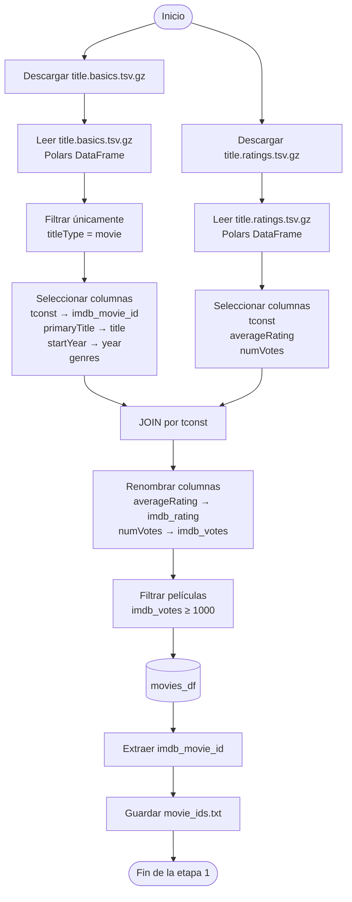
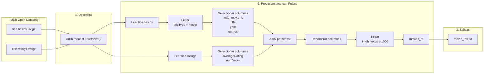

# Download OpenData - IMDB
To document this **first stage of the data pipeline**, it is useful to represent the flow from downloading the open datasets from IMDb to generating the `movie_ids.txt` file, which will serve as input for the next phase of data enrichment.



---
## Diagram with a higher level of detail



---

## Flow explained

```text
IMDb Open Datasets
        │
        ▼
Descarga de archivos .tsv.gz
        │
        ▼
Lectura con Polars
        │
        ├──────────────┐
        ▼              ▼
 title.basics     title.ratings
        │              │
        ▼              ▼
Filtrar películas   Seleccionar ratings
        │              │
        └──────┬───────┘
               ▼
        JOIN por tconst
               │
               ▼
 Renombrar columnas
               │
               ▼
Filtrar ≥1000 votos
               │
               ▼
        movies_df
               │
               ▼
 Extraer imdb_movie_id
               │
               ▼
     movie_ids.txt
```

### What does each stage represent?

| Etapa                | Objetivo                                                                                                                                                 |
| -------------------- | -------------------------------------------------------------------------------------------------------------------------------------------------------- |
| Descarga             | Obtener los datasets públicos de IMDb (`title.basics` y `title.ratings`).                                                                                |
| Lectura              | Cargar los archivos comprimidos en DataFrames de Polars.                                                                                                 |
| Filtrado             | Conservar únicamente registros cuyo `titleType` sea `movie`.                                                                                             |
| Selección            | Mantener únicamente las columnas necesarias para el proyecto.                                                                                            |
| Unión (JOIN)         | Integrar la información descriptiva de las películas con sus calificaciones mediante `tconst`.                                                           |
| Limpieza             | Renombrar columnas y estandarizar el esquema de datos.                                                                                                   |
| Filtrado por calidad | Conservar solo películas con al menos **1000 votos**, eliminando títulos con baja representatividad.                                                     |
| Salida               | Generar `movies_df` y el archivo `movie_ids.txt`, que será utilizado en la siguiente etapa para consultar información adicional mediante la API de OMDb. |
