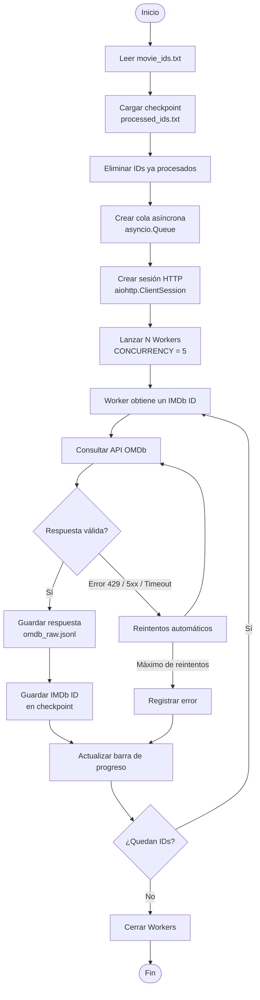
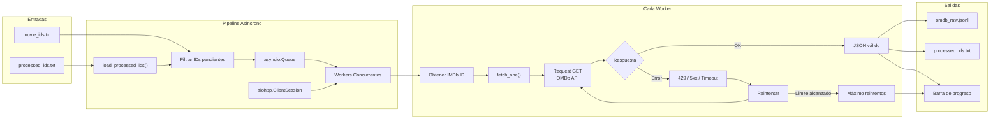
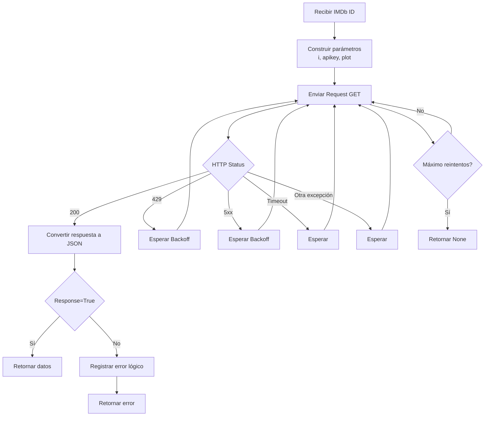
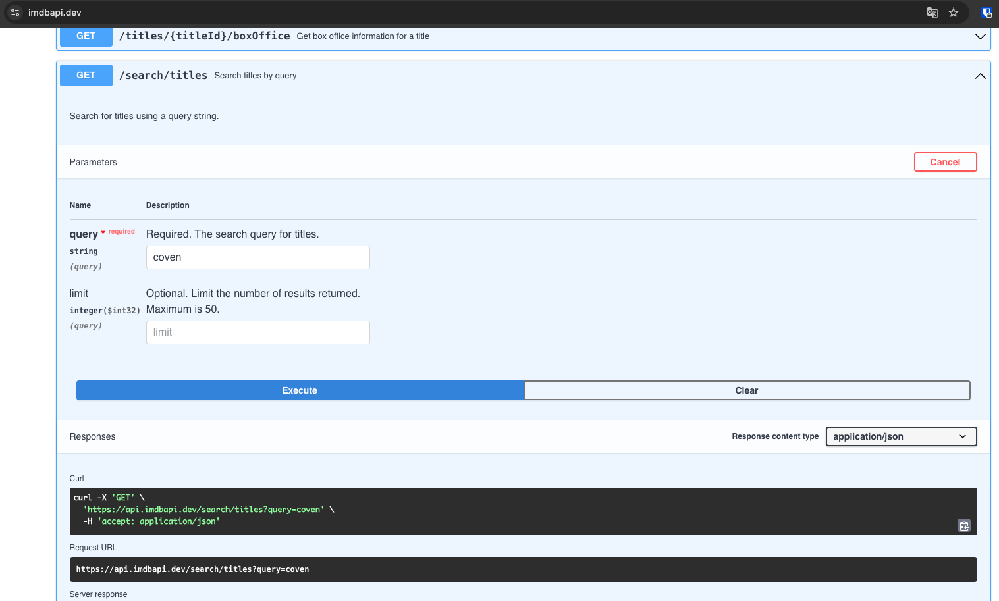
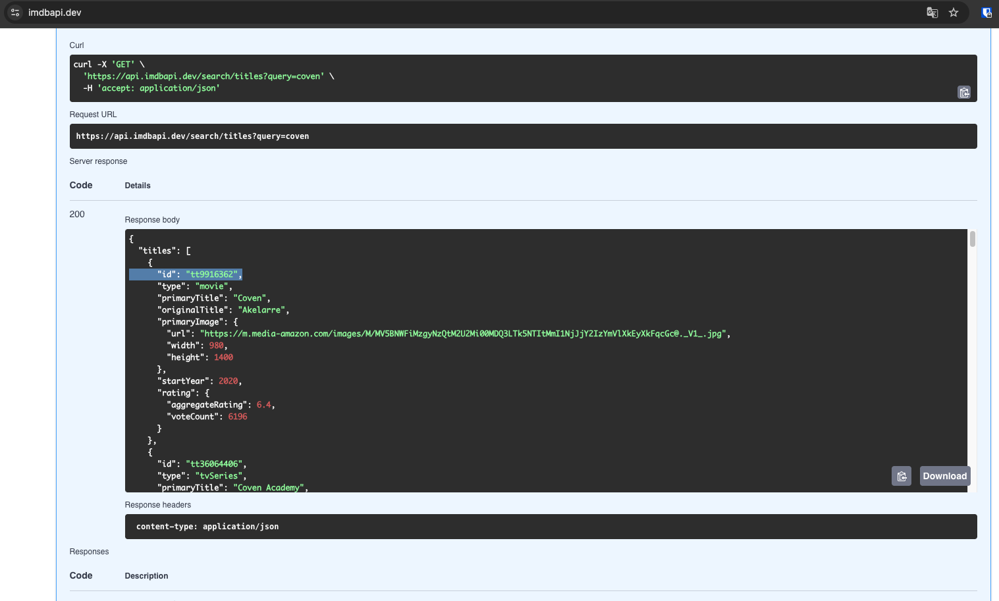
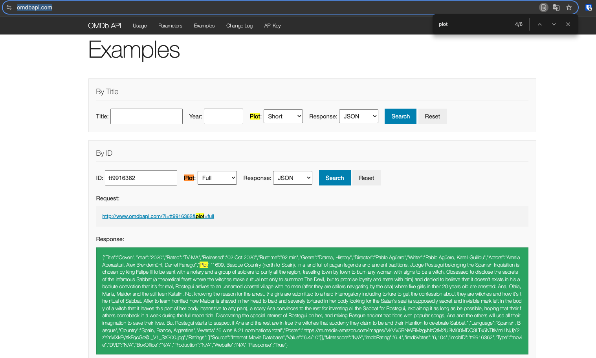

# Download Private Data - OMDB API

For the **second stage of the pipeline**, the goal is to enrich the data obtained from IMDb by querying the **OMDb private API**. The code implements an asynchronous, concurrent, and fault-tolerant process, using **workers**, **checkpoints**, **automatic retries**, and incremental writing in **JSONL** format.

It's a **robust, asynchronous pipeline** for:

* Downloading movie information from the **OMDb API**
* Using **multiple requests in parallel**
* With **intelligent retries**
* **Persisting results incrementally** (JSONL)
* With **checkpointing** to **resume after a crash**
* Without losing data or duplicating requests



---
# Detailed diagram of the internal flow



---

# `fetch_one()` specific diagram

This function concentrates all the logic of resilience against errors.



Manually, this process is:
1. Search for the movie using the IMDB API.

2. Identify the corresponding movie ID.

3. Search the OMDB API for other features using the previously obtained movie ID.


---

# Summary flow

```text
                ┌────────────────────┐
                │  Lista IMDb IDs    │
                │  (input all_ids)   │
                └─────────┬──────────┘
                          │
                          ▼
        ┌─────────────────────────────────┐
        │ load_processed_ids()             │
        │ - lee processed_ids.txt          │
        │ - devuelve set de IDs procesados │
        └─────────┬───────────────────────┘
                  │
                  ▼
        ┌─────────────────────────────────┐
        │ Filtrado de IDs                 │
        │ remaining = all_ids - processed │
        └─────────┬───────────────────────┘
                  │
                  ▼
        ┌─────────────────────────────────┐
        │ asyncio.Queue                   │
        │ - encola IDs restantes          │
        └─────────┬───────────────────────┘
                  │
                  ▼
 ┌────────────────────────────────────────────────────┐
 │                 WORKER POOL (N=5)                  │
 │                                                    │
 │  ┌───────────┐   ┌───────────┐   ┌───────────┐    │
 │  │ Worker 1  │   │ Worker 2  │   │ Worker N  │    │
 │  └─────┬─────┘   └─────┬─────┘   └─────┬─────┘    │
 │        │               │               │          │
 │        ▼               ▼               ▼          │
 │   fetch_one()     fetch_one()     fetch_one()     │
 │        │               │               │          │
 │        ▼               ▼               ▼          │
 │   aiohttp GET     aiohttp GET     aiohttp GET     │
 │   OMDb API        OMDb API        OMDb API        │
 │        │               │               │          │
 │        ▼               ▼               ▼          │
 │  Retry / Backoff / Error handling                   │
 │                                                    │
 └───────────────┬───────────────┬────────────────────┘
                 │               │
                 ▼               ▼
        ┌─────────────────────────────────┐
        │ JSON result (dict) or None       │
        └─────────┬───────────────────────┘
                  │
                  ▼
        ┌─────────────────────────────────┐
        │ async write_lock                │
        │ (previene escrituras concurrentes)
        └─────────┬───────────────────────┘
                  │
                  ▼
        ┌─────────────────────────────────┐
        │ Append JSON line                │
        │ omdb_raw.jsonl                  │
        └─────────┬───────────────────────┘
                  │
                  ▼
        ┌─────────────────────────────────┐
        │ append_processed_id(imdb_id)    │
        │ processed_ids.txt               │
        └─────────┬───────────────────────┘
                  │
                  ▼
        ┌─────────────────────────────────┐
        │ queue.task_done()               │
        └─────────────────────────────────┘
```
---

## Flow Summary (in words)

1. **Load Previous Progress**
    * Already downloaded IDs are read from `processed_ids.txt`

2. **Filter Pending Work**
    * Only new IDs are processed

3. **Enqueue Work**
    * Each IMDb ID is added to `asyncio.Queue`

4. **Concurrent Workers**
   * Up to `CONCURRENCY` simultaneous requests
   * Each worker:
        * consumes an ID
        * calls OMDb
        * handles errors
        * retries if necessary

5. **Secure Persistence**
    * Results are written **one per line** (JSONL)
    * Write protected by a lock

6. **Immediate Checkpoint**
    * The ID is marked as processed
    * The pipeline can be restarted without repeating work


---

## Explanation of each component

| Componente                           | Función                                                                                                                                  |
| ------------------------------------ | ---------------------------------------------------------------------------------------------------------------------------------------- |
| **movie_ids.txt**                    | Lista de identificadores IMDb generada en la Etapa 1.                                                                                    |
| **Checkpoint (`processed_ids.txt`)** | Evita volver a descargar películas ya procesadas y permite reanudar el proceso tras interrupciones.                                      |
| **Queue (`asyncio.Queue`)**          | Distribuye los IDs pendientes entre los distintos workers.                                                                               |
| **Workers concurrentes**             | Procesan múltiples solicitudes a la API OMDb en paralelo (`CONCURRENCY = 5`), mejorando el rendimiento.                                  |
| **`fetch_one()`**                    | Gestiona la consulta a la API, incluyendo reintentos automáticos, manejo de errores HTTP (429, 5xx), timeouts y excepciones inesperadas. |
| **`omdb_raw.jsonl`**                 | Archivo de salida donde cada línea corresponde a la respuesta JSON completa de una película obtenida desde OMDb.                         |
| **Barra de progreso (`tqdm`)**       | Muestra en tiempo real el avance de la descarga.                                                                                         |
